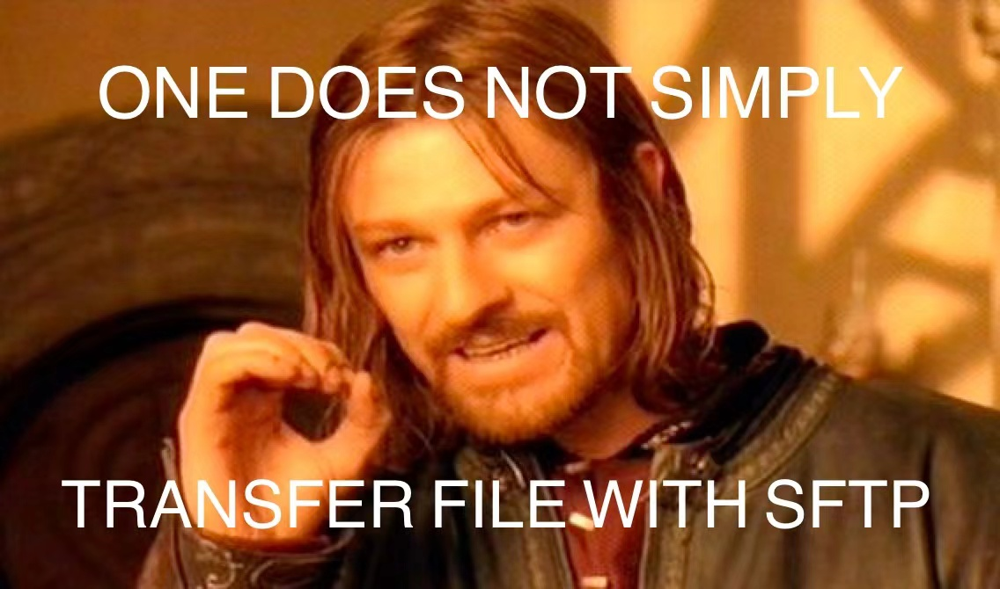

# Mini SFTP Client
Welcome to *Computer Networking*. In this lab, we will build a minimal Secure File Transfer Protocol (SFTP) client that can talk with real servers upon basic POSIX socket interfaces. After finishing this lab, you will (hopefully) get familiar with network application programming and some basic security concerns. We expect this lab takes you between 20 to 30 hours to complete.



## Prerequisite

### Collaboration Policy

**This could be a team work.** You can do this work on your own or team with **another** student (i.e. the maximum number of team members is 2).
Members of a team will get **the same** grade for this lab. 

**Discussion with others.** You can discuss high-level implementation ideas with other teams. But DO NOT copy or look at other teams' codes.

### RFC-compliance

To talk with real servers, we MUST make our implementation RFC-compliant.
Since SFTP is a subsystem of Secure Shell protocol (SSH), we follow the RFC specification of the whole SSH system, including:
- [RFC4251 SSH Protocol Architecture](https://datatracker.ietf.org/doc/html/rfc4251)
- [RFC4253 SSH Transport Layer Protocol](https://datatracker.ietf.org/doc/html/rfc4253)
- [RFC4252 SSH Authentication Protocol](https://datatracker.ietf.org/doc/html/rfc4251)
- [RFC4254 SSH Connection Protocol](https://datatracker.ietf.org/doc/html/rfc4251)
- [IETF Draft SSH File Transfer Protocol](https://datatracker.ietf.org/doc/html/draft-ietf-secsh-filexfer-02)

We highly recommend you read those materials and refer to the specification when your program behaves abnormally.

### Useful Tools

- Git: distributed version control system. 
- CMake and Makefile: build automation, testing, packaging, and installation.
- [Wireshark](https://www.wireshark.org/): the world's foremost and widely-used network protocol analyzer.

## Quick Start

This lab works on both MacOS (validated on 12.2.1 Monterey) and Linux (validated on Ubuntu 18.04 LTS).

### Dependencies

#### CMake
This lab builds with [CMake](https://cmake.org/download/). The latest release is recommended.

#### OpenSSL
This lab uses [OpenSSL](https://www.openssl.org/) as the cryptography library.
- MacOS
```
sudo brew install openssl
```

- Ubuntu Linux
```
sudo apt-get instal libssl-dev
```

### Build All Targets
- Download from Github. You may create a fork and download it.
```
git clone https://github.com/SOAR-PKU/lab-sftp.git
cd lab-sftp
```

#### MacOS
```
# Build the targets. All built objects are in the `build` directory.
cmake -B build -DOPENSSL_ROOT_DIR="Your OpenSSL installation location" -DCMAKE_C_COMPILER="Your gcc installation location" -DCMAKE_C_FLAGS="-DMACOS -DLOG_LEVEL=DEBUG"

cmake --build build 
```
Notes: 
- We validate our implementation using GCC. However, MacOS is shipped with a "fake" GCC (i.e. its `gcc` is actually an alias to `Apple clang`). Thus you may need to install a real GCC (version 11 is recommended) and indicate its location to cmake.
- MacOS is shipped with LibreSSL, not OpenSSL, thus you may also need to indicate your OpenSSL location to cmake.
For example, if you install GCC and OpenSSL with `brew`, your building flags could be:
```
-DOPENSSL_ROOT_DIR=/opt/homebrew/opt/openssl@1.1 -DCMAKE_C_COMPILER=/opt/homebrew/bin/gcc-11
```

#### Linux
```
cmake -B build -DCMAKE_C_FLAGS="-DLINUX -DLOG_LEVEL=DEBUG"
cmake --build build
```

### Usage
```
cd build
./client username@hostname
```

## Coding Guidance

### It all starts with C......
Our code will be done in pure C. C does not provide too much magic, and therefore you have to care about:
- Error handling: Conventionally, C handles errors and exceptions via return value: 0 indicates "OK" and some negative numbers indicate "error".
- Memory management: You are responsible for ALL memory management issues of the C. We impose `xxx_new()` and `xxx_free()` on memory allocation in this lab.

### Logging
You may find the logger helpful when working on this lab. We've provided you with a simple synchronous logger (see `include/libsftp/logger.h`).

```c
// Log with different levels, higher LOG_LEVEL disables lower level logging messages.
LOG_DEBUG("This is a debug message #%d", 1);
LOG_ERROR("This indicates that something is wrong with %s", "my program");

// Log and kill the program
LOG_CRITICAL("Fatal error: %d", errno);
```
You are welcome to add functionalities to and customize your logger. 

## Assignment

In this lab, our goal is to complete the following tasks, each of which is marked as any one of PT (Programming Task), WT (Writing Task), or CP (Checkpoint).

- For the programming tasks, you should submit your implementation (additional documentation files are not necessary);
- For the writing tasks, you should submit your answer to each task;
- For each checkpoint, you should attach images, videos, or [typescript](https://man7.org/linux/man-pages/man1/script.1.html) files, along with a brief explanation.

As specified by RFC standard, the whole SSH system is layered. Thus we recommend the team work on different layers in parallel if you choose to work with a teammate.

### 1. SSH Transport Layer
Please refer to RFC 4253 for detailed information.

SSH transport layer deals with security. It sets up a secure connection with the server. This procedure is explained in the guidebook and some specifications are listed as follows:

#### Binary Packet Protocol
```
uint32    packet_length 
byte      padding_length
byte[n1]  payload; n1 = packet_length - padding_length - 1
byte[n2]  random padding; n2 = padding_length
byte[m]   mac (Message Authentication Code - MAC); m = mac_length
```
- 'packet_length' does not include 'mac' or the  'packet_length' field itself
- (packet_length || padding_length || payload || random padding)
         is a multiple of the cipher block size or 8, whichever is larger
- All implementations MUST be able to process packets with an
   uncompressed payload length of 32768 bytes or less and a total packet size of 35000 bytes or less (including 'packet_length',
   'padding_length', 'payload', 'random padding', and 'mac')

#### Version Exchange

- The server MAY send other lines of data before sending the version string.  Each line SHOULD be terminated by a Carriage Return (CR) and Line Feed (LF).
- Identification string: SSH-protoversion-softwareversion SP comments CR LF

#### PT1 (0pt)
Complete version exchange procedure.

#### CP1 (1pt)
Show the server identification string.

#### Algorithm Negotiation
- The algorithm negotiation format
```
    byte         SSH_MSG_KEXINIT
    byte[16]     cookie (random bytes)
    name-list    kex_algorithms
    name-list    server_host_key_algorithms
    name-list    encryption_algorithms_client_to_server
    name-list    encryption_algorithms_server_to_client
    name-list    mac_algorithms_client_to_server
    name-list    mac_algorithms_server_to_client
    name-list    compression_algorithms_client_to_server
    name-list    compression_algorithms_server_to_client
    name-list    languages_client_to_server
    name-list    languages_server_to_client
    boolean      first_kex_packet_follows
    uint32       0 (reserved for future extension)
```

#### PT2 (1pt)
Complete algorithm negotiation procedure.

#### CP2 (1pt)
Show the negotiated cipher suite (it should be the only cipher suite we support).

#### DH Key Exchange
- We use diffie-hellman-group1-sha1 key exchange algorithm Check section 8 of RFC 4253 for detailed explanation.
- The key exchange produces two values: a shared secret K, and an exchange hash H.  Encryption and authentication keys are derived from these. The exchange hash H from the first key exchange is additionally used as the session identifier, which is a unique identifier for this connection.
- Encryption keys MUST be computed as a digest of the key exchange method specified hash.

- Key exchange ends by each side sending an SSH_MSG_NEWKEYS message. This message is sent with the old keys and algorithms.
```
# client to server
byte      SSH_MSG_KEXDH_INIT
mpint     e

# server to client
byte      SSH_MSG_KEXDH_REPLY
string    server public host key and certificates (K_S)
mpint     f
string    signature of H
```

#### PT3 (1pt)
Complete Diffie-Hellman key exchange procedure.

#### CP3 (1pt)
Show that after the key exchange, all messages are encrypted (you can attach a Wireshark screenshot showing that the the payload of a TCP segment is encrypted).

#### Service Request
- Once the connection is set up, the client asks for service.
```
byte      SSH_MSG_SERVICE_REQUEST
string    service name ("ssh-userauth" or "ssh-connection")
```

#### Message Type Summary
```
SSH_MSG_DISCONNECT             1
SSH_MSG_IGNORE                 2
SSH_MSG_UNIMPLEMENTED          3
SSH_MSG_DEBUG                  4
SSH_MSG_SERVICE_REQUEST        5
SSH_MSG_SERVICE_ACCEPT         6
SSH_MSG_KEXINIT                20
SSH_MSG_NEWKEYS                21
```

#### Encryption
- The ciphers in each direction MUST run independently of each other. In practice however, it is RECOMMENDED that the same
   algorithm be used in both directions.
- We only support AES256-CBC as the encryption algorithm.

#### Integrity
- mac = MAC(key, sequence_number || unencrypted_packet)

- sequence_number is an implicit packet sequence number represented as uint32.  The sequence_number is initialized to zero for the first packet, and is incremented after every packet. The packet sequence_number itself is not included in the packet sent over the wire.

- The MAC algorithms for each direction MUST run independently, and implementations MUST allow choosing the algorithm independently for both directions. In practice however, it is RECOMMENDED that the same algorithm be used in both directions.

- We only support hmac-sha1 (digest length = key length = 20) as the MAC algorithm.

#### Public Key
- format
```
string    certificate or public key format identifier
byte[n]   key/certificate data
```
- ssh-rsa
```
string    "ssh-rsa"
mpint     e
mpint     n
```
- We DO NOT check and verify the server's public key for simplicity, This may incur security compromise but it does not harm functionality.

### 2. SSH Authentication Layer
Please refer to RFC 4252 for detailed information.

SSH authentication layer deals with user authentication. The server authenticates if the client is permitted to access its resource. This procedure is explained in the guidebook and some specifications are listed as follows:

#### Authentication Request
```
byte      SSH_MSG_USERAUTH_REQUEST
string    user name in ISO-10646 UTF-8 encoding [RFC3629]
string    service name in US-ASCII
string    method name in US-ASCII
....      method specific fields
```

#### Authentication Response
- success
    ```
    byte      SSH_MSG_USERAUTH_SUCCESS
    ```
- failure
    ```
    byte         SSH_MSG_USERAUTH_FAILURE
    name-list    authentications that can continue
    boolean      partial success
    ```

#### Banner
- The server MAY send a banner to the client in this layer.
```
byte      SSH_MSG_USERAUTH_BANNER
string    message in ISO-10646 UTF-8 encoding [RFC3629]
string    language tag [RFC3066]
```

#### Message Type Summary
```
SSH_MSG_USERAUTH_REQUEST            50
SSH_MSG_USERAUTH_FAILURE            51
SSH_MSG_USERAUTH_SUCCESS            52
SSH_MSG_USERAUTH_BANNER             53
```

#### Authentication Methods
- We only support password method.
```
byte      SSH_MSG_USERAUTH_REQUEST
string    user name
string    service name
string    "password"
boolean   FALSE
string    plaintext password in ISO-10646 UTF-8 encoding [RFC3629]
```

#### PT4 (1pt)
Complete user authentication procedure.

#### CP4 (1pt)
Show that the server grants access to the client (authentication success).

### 3. SSH Connection Layer
Please refer to RFC 4254 for detailed information.

SSH connection layer deals with data channel. SSH multiplex a connection into multiple virtual channels for service virtualization and flexibility. This procedure is explained in the guidebook and some specifications are listed as follows:

#### Channel Abstraction
- All terminal sessions, forwarded connections, etc., are channels. Either side may open a channel.  Multiple channels are multiplexed into a single connection.
- Channels are flow-controlled.  No data may be sent to a channel until a message is received to indicate that window space is available.

#### Channel Open
Client implementations SHOULD reject any session channel open requests to make it more difficult for a corrupt server to attack the client.
```
byte      SSH_MSG_CHANNEL_OPEN
string    channel type in US-ASCII only ("session" for sftp)
uint32    sender channel
uint32    initial window size
uint32    maximum packet size
....      channel type specific data follows
```

#### Reply to Channel Open
The 'recipient channel' is the channel number given in the original open request, and 'sender channel' is the channel number allocated by the other side.
```
byte      SSH_MSG_CHANNEL_OPEN_CONFIRMATION
uint32    recipient channel
uint32    sender channel
uint32    initial window size
uint32    maximum packet size
....      channel type specific data follows

byte      SSH_MSG_CHANNEL_OPEN_FAILURE
uint32    recipient channel
uint32    reason code
string    description in ISO-10646 UTF-8 encoding [RFC3629]
string    language tag [RFC3066]
```

#### Channel Request
```
byte      SSH_MSG_CHANNEL_REQUEST
uint32    recipient channel
string    "subsystem"
boolean   want reply
string    "sftp"
```

#### Reply to Channel Request
```
byte      SSH_MSG_CHANNEL_SUCCESS
uint32    recipient channel

byte      SSH_MSG_CHANNEL_FAILURE
uint32    recipient channel
```

#### Global Request
- Both the client and server MAY send global requests at any time, and the receiver MUST respond appropriately. 
```
byte      SSH_MSG_GLOBAL_REQUEST
string    request name in US-ASCII only
boolean   want reply
....      request-specific data follows
```

#### PT5 (1pt)
Complete channel open and SFTP subsystem request procedure.

#### CP5 (1pt)
Show that the channel is successfully opened (you can paste the channel number and window size of both ends).

#### Data Transfer

- Flow control: adjust window, Both parties use the following message to adjust the window.
```
byte      SSH_MSG_CHANNEL_WINDOW_ADJUST
uint32    recipient channel
uint32    bytes to add
```

- Send data
```
byte      SSH_MSG_CHANNEL_DATA
uint32    recipient channel
string    data
```

#### Channel Close
```
byte      SSH_MSG_CHANNEL_EOF
uint32    recipient channel

byte      SSH_MSG_CHANNEL_CLOSE
uint32    recipient channel
```

### 4. SFTP Layer
Please refer to [IETF draft on SFTP](https://datatracker.ietf.org/doc/html/draft-ietf-secsh-filexfer-02) for detailed information.

SFTP layer handles file manipulation. We only support opening, closing, reading, and writing of a file (but you are welcomed to add more functionalities).

#### General Packet Format
- All packets transmitted over the secure connection are of the following format:
```
uint32             length
byte               type
byte[length - 1]   data payload
```

#### Initialization
- Two ends negotiate version number.
```
uint32 version
<extension data>
```

#### File Open
- Files are opened and created using the SSH_FXP_OPEN message, whose data part is as follows:
```
# request
uint32        id
string        filename
uint32        pflags
ATTRS         attrs

# response
uint32     id
string     handle
```

#### File Close
- Files are closed using the SSH_FXP_CLOSE message, whose data part is as follows:
```
# request
uint32     id
string     handle

# response
SFTP status message (see below)
```

#### File Read & Write
```
# read
uint32     id
string     handle
uint64     offset
uint32     len

# write
uint32     id
string     handle
uint64     offset
string     data
```

#### Server Response
```
# SSH_FXP_STATUS
uint32     id
uint32     error/status code
string     error message (ISO-10646 UTF-8 [RFC-2279])
string     language tag (as defined in [RFC-1766])

# SSH_FXP_HANDLE
uint32     id
string     handle

# SSH_FXP_DATA
uint32     id
string     data
```

#### PT6 (1pt)
Complete SFTP file manipulation procedure.

#### CP6 (2pts)
Show that your implementation can upload and download source file `client.c` to and from the remote server.

## Grading
This lab are worth 12 points (pts). Your gained points will be your final grade of lab 4 in this course. See points for each task above.

## Submission
You should submit your whole project in an archive named 
- lab4-name-studentID.[tar|tar.gz|zip] if you work on your own
- lab4-name1-studentID1-name2-studentID2.[tar|tar.gz|zip] if you work as a team

In addition to the provided code, you should add:
- a file named not-implemented.pdf listing tasks/features that are required but not implemented. You also need to explicitly give the reasons why you are not implementing them. Submit an empty file if you finished all the tasks. You may lose credits by adding items to this list, but being dishonest on this will make you lose more;
- a directory named `checkpoint/` containing your texts, images, videos, or typescript files for each checkpoint.

For submission, please send an email to altrialist@stu.pku.edu.cn. Missing the deadlines incurs a penalty.

## Acknowledgement

This work is inspired and guided by [libssh](https://www.libssh.org/).
